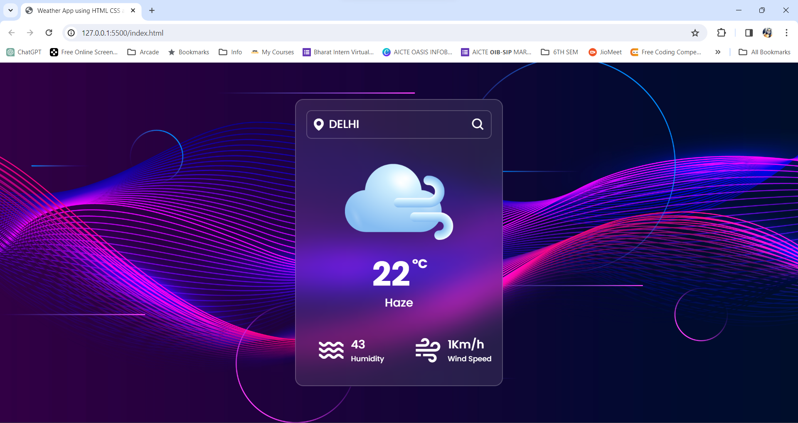
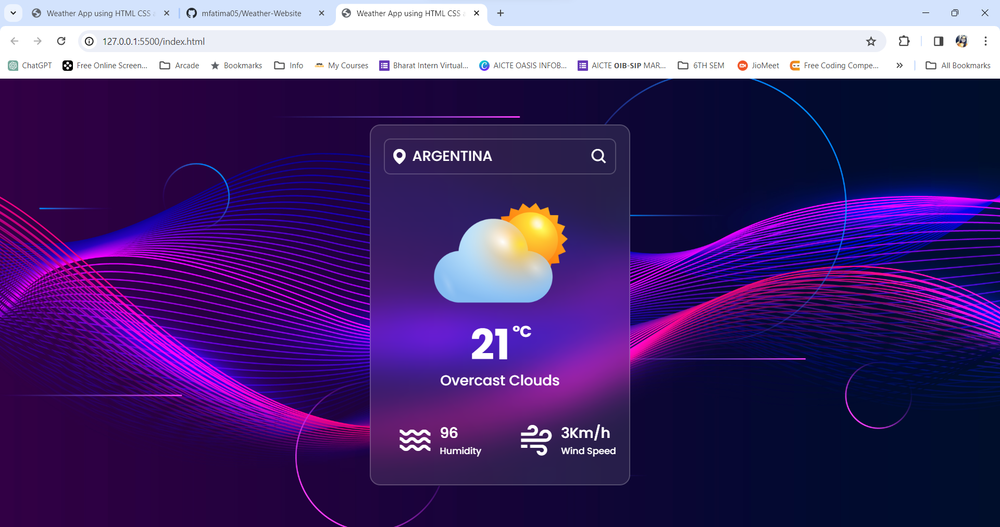

# Weather-Website
In this, I build a website using Html, Css, Js that fetches weather data from an API and displays the current weather conditions.  
Images have been attached below to enhance comprehension of this website.

